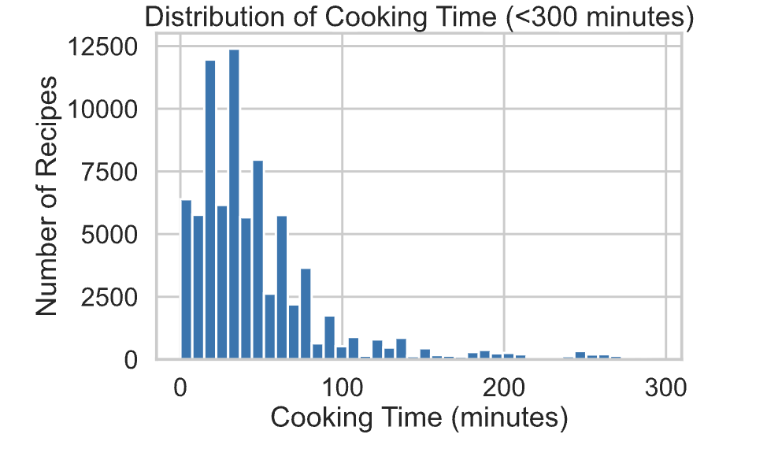
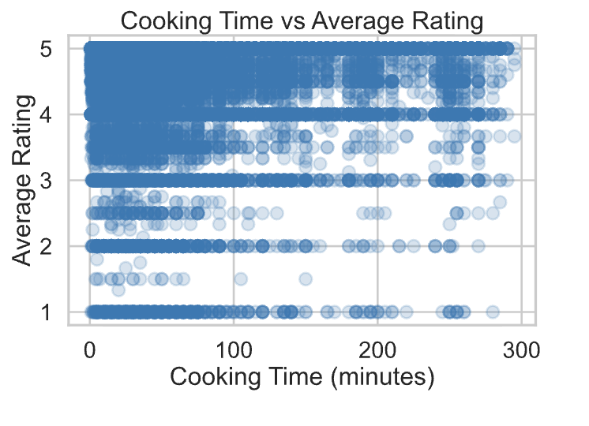

# Correlation of Cooking Time vs Average Rating

## Project Overview
This project investigates the relationship between the **cooking time of a recipe** and its **average rating**.

The goal is to determine whether recipes that take longer to cook tend to receive higher ratings than recipes that take less time.

---

## Main Question
Do recipes with longer cooking times tend to have higher average ratings?

This topic is interesting because more often than not, the cooking time of the recipe itself actually reflects how complex the recipe is (ingredient preparation and effort), which could influence how these users evaluate the recipes. The more complicated a recipe is, the likelier more problems are to occur during the process, possibly giving the user the false impression of a recipe not being good overall. 

---

## Dataset Description 
The Two datasets that I used included:

- 'RAW_recipes.csv' (83782 rows, 12 columns)
- 'interactions.csv' (731927 rows, 5 columns)

The two datasets were merged on the recipe identifiers in order to connect the characteristics fo the recipes alongside the user ratings. 

After merging, the main columns we want to look at include:

- 'minutes': cooking time in mins
- 'rating': individual user rating
- 'average_ratings': mean rating per recipe
- 'n_ingredients': # of ingredients
- 'calories': calories per recipe
- 'protein': grams of protein per recipe
- 'sugar': grams of sugar per recipe

---

## Data Cleaning

The data cleaning process before the actual analysis includes: 

- Merging 'RAW_recipes.csv' and 'interactions.csv' together on the recipe id
- Replcaed all ratings of '0' with missing values (NaN), important because we want missing ratings rather than super low ratings themselves
- Calculated the average rating for each recipe
- Removed unrealistic cooking times greater than 300 minutes so that we reduce the outliers within our dataset
- Split the nutrition lists into their own individual columns

Given this, the dataset sohuld include recipes with realiable and realistic information. 

---

## Exploratory Data Analysis
For this, we conducted both Univariate Analysis and Bivariate Analysis.

### Univariate Analysis
Here, we examined:
- Distribution of cooking times 
- Distribution of average ratings

The graph shown is right-skewed, we note that most recipes have lower preparation times

### Bivariate Analysis
In this analysis, we examine the comparison between cooking time and average rating to see if there is a correlation between longer cooking times and rating differences.

Although some longer recipes receive high ratings, the overall relationship between cooking time and average rating is weak. Ratings are concentrated near high values across both short and long cooking times, which shows us that cooking time alone does not strongly determine the recipe ratings

---

## Missingness Assessment
To study whether missing ratings depend on observed variables, permutation tests were performed using 'rating_missing as an indicator for whether a rating is missing.

- A permutation test comparing cooking time 'minutes' showed that the missingness of 'rating depends on cooking time. Recipes with missing ratings tend to differ in cooking time compared to recipes with observed ratings.

- A second permutation test using 'n_ingreidnets showed weaker evidence of dependence, which suggests that missingness does not strongly depend on ingredient count.

These results suggest that rating missingness is not completely random and may be partially explained by observed recipe characteristics.

---

## Hypothesis Testing

### Null Hypothesis:
There is **no difference in the average rating** between recipes that take **30 minutes or less** and recipes that take **more than 30 minutes** to cook.

quick = long

This implies that **cooking time does not affect the average rating**.

---

### Alternative Hypothesis:
There **is a difference in the average rating** between recipes that take **30 minutes or less** and recipes that take **more than 30 minutes** to cook.

quick != long

This implies that **cooking time does affect the average rating**.

---

## Testing 

### Method
For our test, a permutation test was used to compare the differences within the average ratings between the two categorical groups (<=30 minutes and > 30 minutes).

### Test Statistic
The difference in mean average ratings between the two groups is the best approach here. 

### Significance Level
alpha = 0.05

---

## Key Variables
Key variables included within the test:
- 'minutes' - cooking time
- 'rating' - individual user rating
- 'average_ratings' - average rating recipe
- 'n_ingredients' - # of ingredients
- 'calories' - # of calories in recipe
- 'protein' - #g of protein in recipe
- 'sugar' - #g of sugar in recipe

Nutrional values extracted from original nutrition field for analysis 

---

## Baseline Model
Within our baseline model, we used a logistic regression that included two variables:
- 'minutes'
- 'n_ingredients'

### Feature Processing
Both 'minutes' and 'n_ingriedients' were standardized using the transformers 'StandardScaler' 

---

## Final Model
The final model however included some nutrition variables. So overall, it came out to be:
- 'minutes'
- 'n_ingredients'
- 'calories'
- 'protein'
- 'sugar'

These variables were able to improve the predictive power of our model.

### Model Choice 
Logistic regression was used in this case.

---

## Fiarness Analysis
The model accuracy was compared across two different groups including:
- Quick Recipes (less than 30 minutes)
- Long recipes (more than 30 minutes)

---

### Result

The observed difference in mean average ratings between quick recipes and longer recipes was approximately 0.031 with a p-value of 0.001.

Quick recipes had a slightly higher mean rating than longer recipes.

The permutation test produced a p-value less than 0.05, so we reject the null hypothesis.

This suggests that the difference in ratings is unlikely to be due to random chance alone.

However, the difference is very small in magnitude, meaning cooking time may have statistical significance but limited practical effect on recipe ratings.