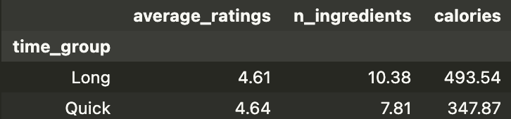

# Correlation of Cooking Time vs Average Rating

## Project Overview
This project investigates the relationship between the cooking time of a recipe** and its average rating.

The goal is to determine whether recipes that take longer to cook tend to receive higher ratings than recipes that take less time.

---

## Main Question
Do recipes with longer cooking times tend to have higher average ratings?

This topic is interesting because more often than not, the cooking time of the recipe itself actually reflects how complex the recipe is (ingredient preparation and effort), which could influence how these users evaluate the recipes. The more complicated a recipe is, the likelier more problems are to occur during the process, possibly giving the user the false impression of a recipe not being good overall. 

---

## Dataset Description 
The Two datasets that I used included:

- 'RAW_recipes.csv' (83782 rows, 12 columns)
- 'interactions.csv' (731927 rows, 5 columns)

The two datasets were merged on the recipe identifiers in order to connect the characteristics fo the recipes alongside the user ratings. 

After merging, the main columns we want to look at include:

- 'minutes': cooking time in mins
- 'rating': individual user rating
- 'average_ratings': mean rating per recipe
- 'n_ingredients': # of ingredients
- 'calories': calories per recipe
- 'protein': grams of protein per recipe
- 'sugar': grams of sugar per recipe

---

## Data Cleaning

The data cleaning process before the actual analysis includes: 

- Merging 'RAW_recipes.csv' and 'interactions.csv' together on the recipe id
- Replcaed all ratings of '0' with missing values (NaN), important because we want missing ratings rather than super low ratings themselves
- Calculated the average rating for each recipe
- Removed unrealistic cooking times greater than 300 minutes so that we reduce the outliers within our dataset
- Split the nutrition lists into their own individual columns

Given this, the dataset sohuld include recipes with realiable and realistic information. 

---

## Exploratory Data Analysis
For this, we conducted both Univariate Analysis and Bivariate Analysis.

### Univariate Analysis
Here, we examined:
- Distribution of cooking times 
- Distribution of average ratings

<iframe src="assets/AverageCookingTimeDistribution.html" width="100%" height="500" frameborder="0"></iframe>

<iframe src="assets/DistributionOfAverageRecipeRatings.html" width="100%" height="500" frameborder="0"></iframe>

The graph shown is right-skewed, we note that most recipes have lower preparation times

### Bivariate Analysis
In this analysis, we examine the comparison between cooking time and average rating to see if there is a correlation between longer cooking times and rating differences.

<iframe src="assets/CookingTimeVsAverageRating.html" width="100%" height="500" frameborder="0"></iframe>

Although some longer recipes receive high ratings, the overall relationship between cooking time and average rating is weak. Ratings are concentrated near high values across both short and long cooking times, which shows us that cooking time alone does not strongly determine the recipe ratings

### Grouped Table

This grouped table shows that longer recipes tend to include more ingredients and higher calorie content, while average ratings remain very similar across both groups. Quick recipes have slightly higher average ratings, but the difference is very small.

---

## Assessment of Missingness 
To study whether missing ratings depend on observed variables, permutation tests were performed using 'rating_missing' as an indicator for whether a rating is missing. Users may choose not to leave a rating depending on their personal recipe experience, satisfaction, or uncertainty, which are not directly observed in the dataset. This makes rating a possible MNAR column because the missingness may depend on unobserved user experience rather than only observed recipe features.

- A permutation test comparing cooking time 'minutes' showed that the missingness of 'rating' depends on cooking time. Recipes with missing ratings tend to differ in cooking time compared to recipes with observed ratings.

- A second permutation test using 'n_ingreidnets' showed weaker evidence of dependence, which suggests that missingness does not strongly depend on ingredient count.

These results suggest that rating missingness is not completely random and may be partially explained by observed recipe characteristics.

<iframe src="assets/CookingTimeByMissingness.html" width="100%" height="500" frameborder="0"></iframe>

---

## Hypothesis Testing

### Null Hypothesis:
There is **no difference in the average rating** between recipes that take **30 minutes or less** and recipes that take **more than 30 minutes** to cook.

quick = long

This implies that **cooking time does not affect the average rating**.

---

### Alternative Hypothesis:
There **is a difference in the average rating** between recipes that take **30 minutes or less** and recipes that take **more than 30 minutes** to cook.

quick != long

This implies that **cooking time does affect the average rating**.

---

## Framing a Prediction Problem 

The prediction task in this project is a classification problem where we predict whether a recipe will receive a higher rating based on recipe characteristics that are known before a user interacts with the recipe.

A binary response variable was created by labeling recipes with higher average ratings as positive outcomes and lower average ratings as negative outcomes. This was done because the response variable is categorical rather than continuous.

The predictor variables used in the model include cooking time (minutes), number of ingredients (n_ingredients), and additional nutritional variables such as calories, protein, and sugar. These features are all available before a recipe is prepared, so the model does not rely on information that would only be known after the user submits a rating.

This allows the model to estimate whether recipe complexity and nutritional composition are associated with recipes that are more likely to receive stronger user ratings.

---

## Key Variables
Key variables included within the test:
- 'minutes' - cooking time
- 'rating' - individual user rating
- 'average_ratings' - average rating recipe
- 'n_ingredients' - # of ingredients
- 'calories' - # of calories in recipe
- 'protein' - #g of protein in recipe
- 'sugar' - #g of sugar in recipe

Nutrional values extracted from original nutrition field for analysis 

---

## Baseline Model
Within our baseline model, we used a logistic regression that included two variables:
- 'minutes'
- 'n_ingredients'

These two variables were chosen for the baseline model because they are simple numeric recipe characteristics that may influence how users evaluate recipes. Cooking time shows how long a recipe takes to prepare, which relates directly to recipe complexity and convenience. The number of ingredients reflects how many components are involved in the recipe, which can also affect user perception since recipes with more ingredients may be viewed as more complex or demanding.

The baseline model achieved an accuracy of 0.755.

### Feature Processing
Both 'minutes' and 'n_ingriedients' were standardized using the transformers 'StandardScaler' 

---

## Final Model
The final model however included some nutrition variables. So overall, it came out to be:
- 'minutes'
- 'n_ingredients'
- 'calories'
- 'protein'
- 'sugar'

The final model added nutritional variables because the nutrition of a recipe could  influence user ratings beyond its preparation complexity. Calories were included because richer or heavier meals may affect overall satisfaction differently than lighter meals. Protein was added because protein content often reflects meal substance and may relate to how filling or complete a recipe feels. Sugar was included because sweetness can influence preference, especially with dessert or snack recipes.

The final model achieved an accuracy of 0.755. While nutritional variables add additional recipe information, they do not substantially improve predictive performance beyond the simpler baseline features.

### Model Choice 
Logistic regression was used in this case because the response variable is binary and all the variables we included are numeric.

---

## Fairness Analysis
The model accuracy was compared across two different groups including:
- Quick Recipes (less than 30 minutes)
- Long recipes (more than 30 minutes)

The fairness metric used was classification accuracy across both groups. Quick recipes had an accuracy of approximately 76%, while longer recipes had an accuracy of approximately 75%.

This small difference suggests that the model performs similarly across both groups, meaning there is no strong evidence that the model unfairly favors either quick or long recipes.

The observed difference in mean average ratings between quick recipes and longer recipes was approximately 0.031 with a p-value of 0.001.

The permutation test produced a p-value less than 0.05, so we reject the null hypothesis.

This suggests that the difference in ratings is unlikely to be due to random chance alone.
